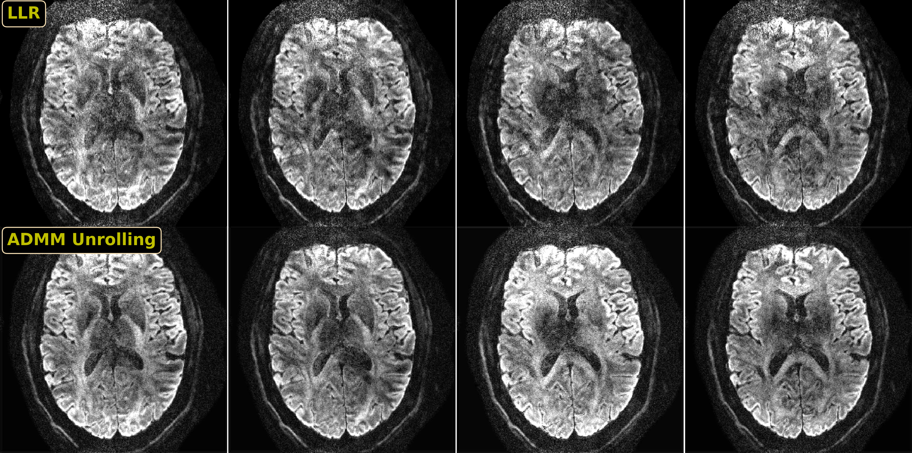

# Generalized Deep Diffusion-Weighted Imaging (DeepDWI) Reconstruction Framework

## Introduction

DeepDWI implements self-supervised learning image reconstruction techniques for DWI.

<p align="center">
  
  <em>Prospectively self-gated diffusion-weighted image reconstruction on a iEPI data acquired with 0.7 mm isotropic resolution. Displayed images are one axial slice at four different diffusion-encoding directions. Self-gated zero-shot self-supervised learning (ZSSSL) enables much cleaner delineations of diffusion contrasts than locally-low rank (LLR) regularized reconstruction.</em>
</p>

## Installation

### Let's use `conda` to install DeepDWI:

1. create a new conda environment named ('deepdwi', you can use other names as you like):

    ```bash
    conda create -n deepdwi python==3.10
    ```

2. activate the environment:

    ```bash
    conda activate deepdwi
    ```

3. install `deepdwi`:

    ```bash
    python -m pip install -e .
    ```

4. download and install `sigpy`:

    ```bash
    git clone https://github.com/ZhengguoTan/sigpy.git
    ```
    and then ```cd``` to the sigpy directory,
    ```bash
    python -m pip install -e .
    ```

That's it! Enjoy `deepdwi`!

## Features

1. The repo implements several state-of-the-art [algorithm unrolling](https://doi.org/10.1109/MSP.2020.3016905) for high-dimensional diffusion-weighted imaging reconstruction, incl.

    (1) Variational Network ([VarNet](https://doi.org/10.1002/mrm.26977));

    (2) Model-based deep learning architecture ([MoDL](https://doi.org/10.1109/TMI.2018.2865356));

    (3) Alternating Direction Method of Multipliers ([ADMM](https://doi.org/10.1561/2200000016)).

* This implementation is also applicable to other **high-dimensional MRI reconstruction**!


## Data

Before running the scripts in `DeepDWI`, you need to download the following data to the `/data/` folder:

| Spatial Resolution (mm3) | Diffusion Mode | Acceleration (in-plane x slice) | Shots | Navigator | Link |
|---|---|---|---|---|---|
| 0.7 x 0.7 x 0.7 | MDDW 20 directions with b-value of 1000 s/mm2 | 2 x 2 | 3 | Yes | [](https://doi.org/10.5281/zenodo.10781347) |
| 0.7 x 0.7 x 0.7 | MDDW 20 directions with b-value of 1000 s/mm2 | 2 x 2 | 3 | No | [](https://doi.org/10.5281/zenodo.13864504) |
| 1.0 x 1.0 x 1.0 | MDDW 20 directions with b-value of 1000 s/mm2 | 1 x 3 | 4 | No  | [](https://doi.org/10.5281/zenodo.10668487) |
| 1.0 x 1.0 x 1.0 | 3-shell 126 directions with b-values up to 3000 s/mm2 | 3 x 3 | 2 | No  | [](https://doi.org/10.5281/zenodo.13171692) |

## Examples

1. load the data

    ```bash
    cd data/

    python load.py --records 10781347 --file 0.7mm_21-dir_R2x2_kdat_slice_000.h5

    python load.py --records 10781347 --file 0.7mm_21-dir_R2x2_coils.h5
    ```

2. run the zsssl training

    ```bash
    cd examples/
    python run_zsssl.py --mode train
    ```

3. run the zsssl testing

    ```bash
    python run_zsssl.py --mode test --slice_idx 0 --checkpoint /examples/path/to/zsssl_best.pth
    ```

## References

If you find the open-source codes/data useful, please cite:

```bibtex
@Article{tan_2024_sg_zsl,
    Title     = {{High-Resolution Motion-Robust Diffusion-Weighted Imaging with Self-Gated Zero-Shot Self-Supervised Reconstruction}},
    Author    = {Tan, Zhengguo and Liebig, Patrick A and Hofmann, Annika and Laun, Frederik B and Knoll, Florian},
    Journal   = {},
    Year      = {},
    Volume    = {},
    Pages     = {},
    doi       = {}
}
