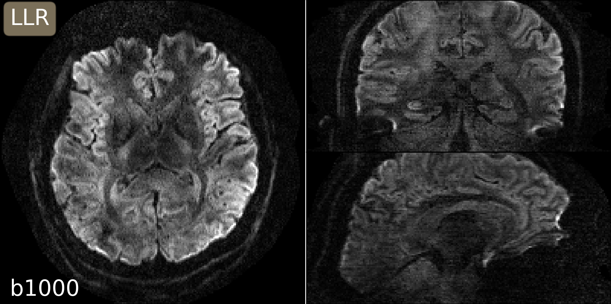
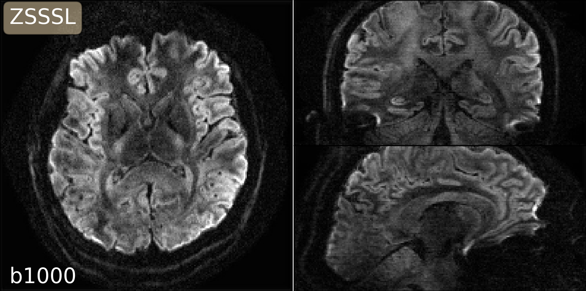

# This folder creates figures for b3000:

## setup the directory of the `DeepDWI` folder in the terminal:

```bash
export DWIDIR=/path/to/DeepDWI
cd ${DWIDIR}/figures/b3000
```

## 1. run the reconstruction with the LLR regularization:

<!-- TODO: -->
```bash
sbatch sbatch_llr.sh  # SLOW! This would take days!
```

## 2. run the zsssl training and reconstruction:

<!-- TODO: -->
```bash
sbatch sbatch_zsssl.sh
```

## 3. plot results

```bash
python plot_1.0mm_3_b1000.py
python plot_1.0mm_3_b3000.py
```

<p align="center">
  
  

  
  
</p>
