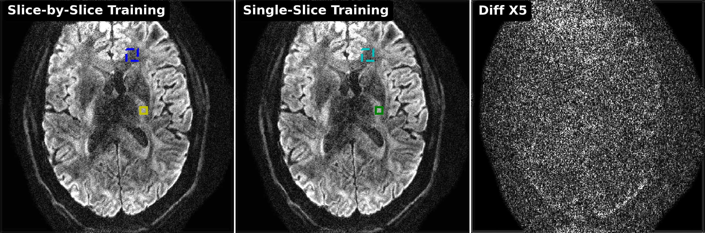
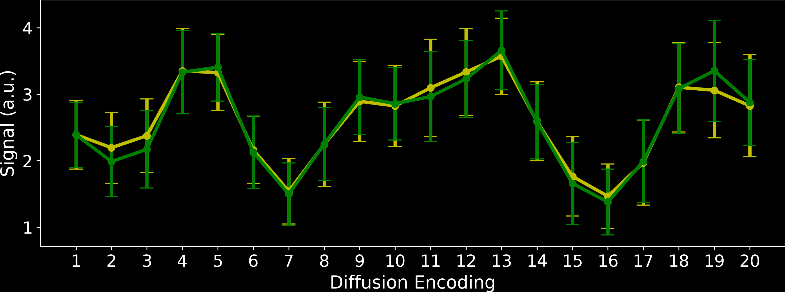

# This folder creates figures for model generalization:

## 0. setup the directory of the `DeepDWI` folder in the terminal:

```bash
export DWIDIR=/path/to/DeepDWI
cd ${DWIDIR}/figures/generalization
```

## 1. training and testing

### data: https://zenodo.org/records/13864504

### (a) **Single-slice training**: I run the training on the 0th slice and then use the checkpoint to test it on the 1st slice. The checkpoint is shared [here](examples/2024-09-20_zsssl_0.7mm_21-dir_R2x2_vol3_scan1_kdat_slice_000_norm-kdat-1.0_self_ResNet2D_ResBlock-12_kernel-3_ADMM_08_lamda-0.050_Adam_lr-0.000500_MixL1L2Loss/zsssl_best.pth).

### (b) **Slice-by-Slice training**: I run the training on the 1st slice and then use the checkpoint to test it on the same slice. The checkpoint is shared [here](examples/2024-09-24_zsssl_0.7mm_21-dir_R2x2_vol3_scan1_kdat_slice_001_norm-kdat-1.0_self_ResNet2D_ResBlock-12_kernel-3_ADMM_08_lamda-0.050_Adam_lr-0.000500_MixL1L2Loss/zsssl_best.pth).

### [**NOTE**]: If you re-do the abovementioned experiments, please remember to change the file directory in the [plot](figures/generalization/plot.py) script.

## 2. plot results

```bash
python plot.py
```
<p align="center">
  
  
</p>