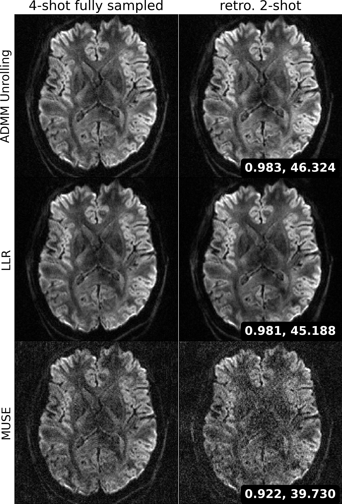

# This folder creates the figure for ground-truth retrospective study:

First, download the necessary config and checkpoints:

### 4-shot fully sampled:

```bash
wget -q https://zenodo.org/records/17623589/files/gt_1.0mm_21-dir_R1x3_4shot_zsssl.yaml

wget -q https://zenodo.org/records/17623589/files/gt_1.0mm_21-dir_R1x3_4shot_zsssl_best.pth
```

### retrospectively undersampled 2-shot:

```bash
wget -q https://zenodo.org/records/17623589/files/gt_1.0mm_21-dir_R1x3_2shot_zsssl.yaml

wget -q https://zenodo.org/records/17623589/files/gt_1.0mm_21-dir_R1x3_2shot_zsssl_best.pth
```

## ADMM Unroll

### 4-shot fully sampled:

```bash
cd ../../examples

python run_zsssl.py --mode train --config gt_1.0mm_21-dir_R1x3_4shot_zsssl.yaml
```

Inference

```bash
for S in {0..37}; do
    echo $S
    python run_zsssl.py --mode test --config gt_1.0mm_21-dir_R1x3_4shot_zsssl.yaml --slice_idx $S --checkpoint gt_1.0mm_21-dir_R1x3_4shot_zsssl_best.pth
done
```

### retrospectively undersampled 2-shot:

```bash
cd ../../examples

python run_zsssl.py --mode train --config gt_1.0mm_21-dir_R1x3_2shot_zsssl.yaml
```

Inference

```bash
for S in {0..37}; do
    echo $S
    python run_zsssl.py --mode test --config gt_1.0mm_21-dir_R1x3_2shot_zsssl.yaml --slice_idx $S --checkpoint gt_1.0mm_21-dir_R1x3_2shot_zsssl_best.pth
done
```

## MUSE

### 4-shot fully sampled:

```bash
cd ../../examples

python run_llr.py --prefix 1.0mm_21-dir_R1x3 --slice_idx 0 --slice_inc 38 --muse

python comb_slice.py --dir ../data/ --method_pre 1.0mm_21-dir_R1x3_MUSE --method_post "" --key DWI --MB 3 --slices 38

cd ../data

mv data/1.0mm_21-dir_R1x3_MUSE.h5 gt_1.0mm_21-dir_R1x3_4shot_MUSE.h5
```

### retrospectively undersampled 2-shot:

```bash
cd ../../examples

python run_llr.py --prefix 1.0mm_21-dir_R1x3 --slice_idx 0 --slice_inc 38 --muse --shot 2

python comb_slice.py --dir ../data/ --method_pre 1.0mm_21-dir_R1x3_MUSE_2shot --method_post "" --key DWI --MB 3 --slices 38

cd ../data

mv 1.0mm_21-dir_R1x3_MUSE_2shot.h5 gt_1.0mm_21-dir_R1x3_2shot_MUSE.h5
```

## LLR

### 4-shot fully sampled:

```bash
cd ../../examples

python run_llr.py --prefix 1.0mm_21-dir_R1x3 --slice_idx 0 --slice_inc 38 --jets

python comb_slice.py --dir ../data/ --method_pre 1.0mm_21-dir_R1x3_JETS --method_post "" --key DWI --MB 3 --slices 38

cd ../data

mv 1.0mm_21-dir_R1x3_JETS.h5 gt_1.0mm_21-dir_R1x3_4shot_LLR.h5
```

### retrospectively undersampled 2-shot:

```bash
cd ../../examples

python run_llr.py --prefix 1.0mm_21-dir_R1x3 --slice_idx 0 --slice_inc 38 --jets --shot 2

python comb_slice.py --dir ../data/ --method_pre 1.0mm_21-dir_R1x3_JETS_2shot --method_post "" --key DWI --MB 3 --slices 38

cd ../data

mv 1.0mm_21-dir_R1x3_JETS_2shot.h5 gt_1.0mm_21-dir_R1x3_2shot_LLR.h5
```

## plot results:

```bash
python plot.py
```

<p align="center">
  
</p>