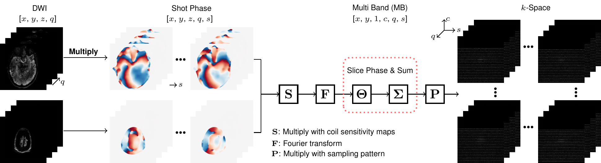

# This folder creates figures for models:

## Multi-shot EPI with ky-shift encoding

  

## Forward model (fwd)

The fwd plot is created from the submodule [plot_sms_diff_model](./plot_sms_diff_model/), written in LaTeX.

  

## ZSSSL for DWI

The zsssl plot is created from the submodule [plot_zsssl](./plot_zsssl/), written in LaTeX.

  

## ResNet

  

