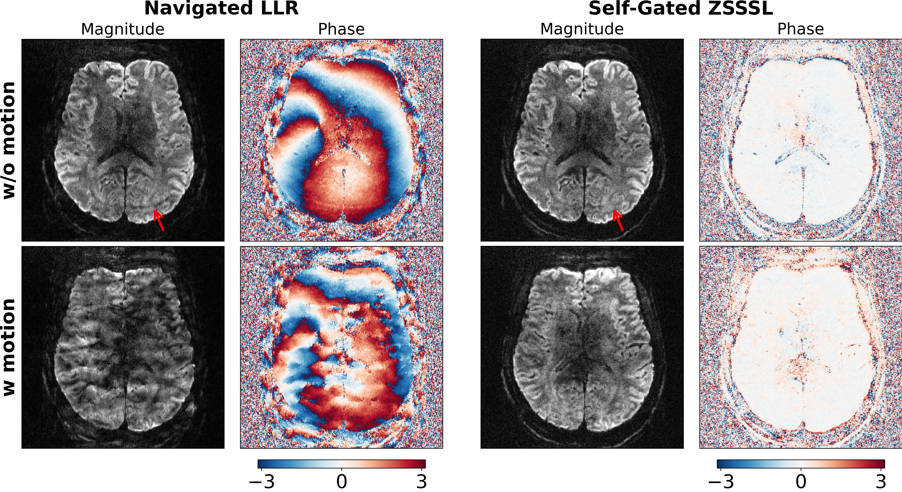
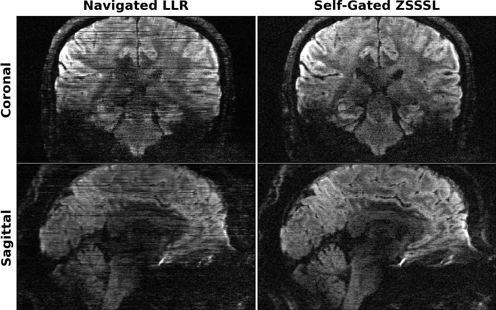

# This folder creates figures for regularzations:

* Locally Low Rank (LLR)
* Zero-Shot Self-Supervised Learning (ZSSSL)

## 0. setup the directory of the `DeepDWI` folder in the terminal:

```bash
export DWIDIR=/path/to/DeepDWI
cd ${DWIDIR}/figures/motion
```

## 1. run the reconstruction with the LLR regularization:

```bash
python run_llr_regularization.py
```

## 2. run the reconstruction with the learned VAE model as regularization:

```bash
python run_vae_regularization.py
```

## 3. run ZSSSL

```bash
sbatch sbatch_zsssl.sh
```

## 4. plot results

```bash
python plot_0.7mm_tra.py
python plot_0.7mm_cor_sag.py
```

<p align="center">
  
</p>

<p align="center">
  
</p>