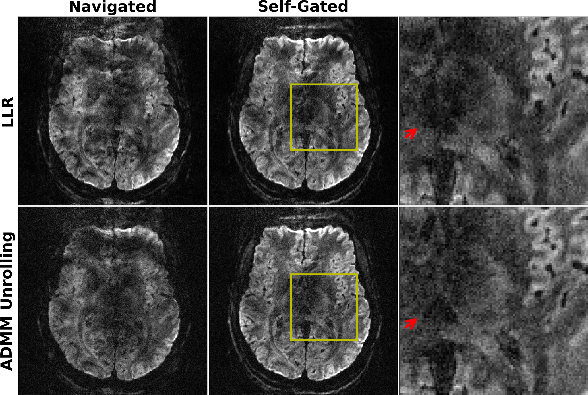
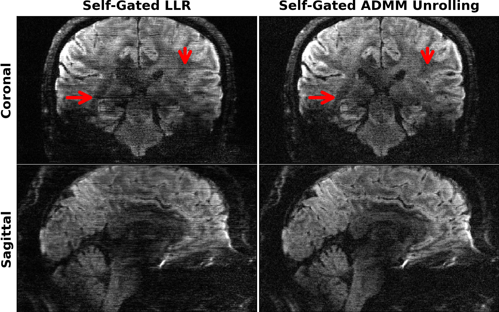

# This folder creates figures for regularzations:

* Locally Low Rank (LLR)
* Zero-Shot Self-Supervised Learning (ZSSSL)

## 0. setup the directory of the `DeepDWI` folder in the terminal:

```bash
export DWIDIR=/path/to/DeepDWI
cd ${DWIDIR}/figures/motion
```

## 1. LLR:

### 1.1. run llr-regularized recon:

```bash
sbatch sbatch_llr.py
```

### 1.2. combine slices:

```bash
cd ${DWIDIR}/examples

python comb_slice.py --dir data --method_pre 0.7mm_21-dir_R2x2_vol1_scan1_JETS_PHASE-NAVI-REDU --method_post '' --key dwi_comb_jets --MB 2 --slices 88
```

## 2. ZSSSL

### 2.1. run ZSSSL training and testing

```bash
sbatch sbatch_zsssl.sh
```

### 2.2. combine slices

```bash
cd ${DWIDIR}/examples

python comb_slice.py --dir 2024-05-22_zsssl_0.7mm_21-dir_R2x2_vol1_scan1_kdat_slice_040_norm-kdat-1.0_navi_ResNet2D_ResBlock-12_kernel-3_ADMM_08_lamda-0.050_Adam_lr-0.000500_MixL1L2Loss --method_pre zsssl --method_post _test_shot-retro-0 --key ZS --MB 2 --slices 88

python comb_slice.py --dir 2024-05-23_zsssl_0.7mm_21-dir_R2x2_vol1_scan1_kdat_slice_040_norm-kdat-1.0_self_ResNet2D_ResBlock-12_kernel-3_ADMM_08_lamda-0.050_Adam_lr-0.000500_MixL1L2Loss --method_pre zsssl --method_post _test_shot-retro-0 --key ZS --MB 2 --slices 88
```

## 3. plot results

```bash
python plot_0.7mm_tra_4.py
```
<p align="center">
  
</p>

```bash
python plot_0.7mm_cor_sag.py
```
<p align="center">
  
</p>