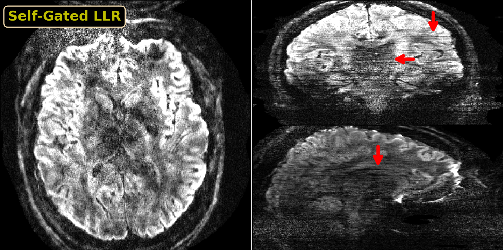
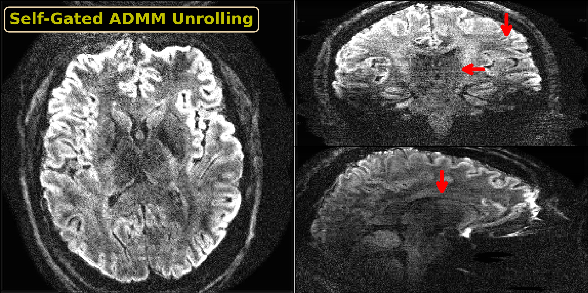

# This folder creates figures for regularzations:

* Locally Low Rank (LLR)
* Zero-Shot Self-Supervised Learning (ZSSSL)

## 0. setup the directory of the `DeepDWI` folder in the terminal:

```bash
export DWIDIR=/path/to/DeepDWI
cd ${DWIDIR}/figures/motion_self
```

## x. plot results

```bash
python plot.py
```
<p align="center">
  
  
  
  
  
  
</p>

```bash
python plot_vol3.py
```
<p align="center">
  
</p>