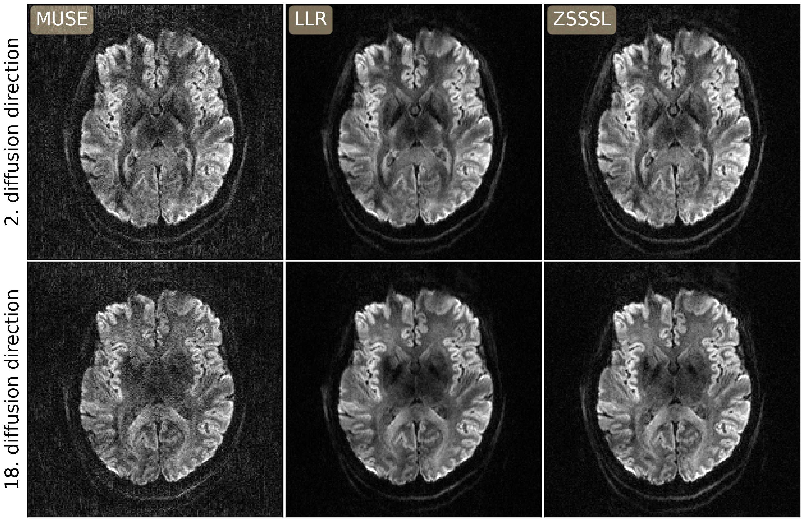

# This folder creates figures for regularzations:

* Locally Low Rank (LLR)
<!-- * Variatinal AutoEncoder (VAE) -->
* Zero-Shot Self-Supervised Learning (ZSSSL)

## setup the directory of the `DeepDWI` folder in the terminal:

```bash
export DWIDIR=/path/to/DeepDWI
cd ${DWIDIR}/figures/regularizations
```

## 1. run the reconstruction with the LLR regularization:

#### (a) 4-shot fully-sampled data

```bash
python run_llr_regularization.py
```

#### (b) retrospectively 2-shot undersampled data

```bash
python run_llr_regularization.py --N_shot_retro 2
```

<!-- ## 2. run the reconstruction with the learned VAE model as regularization:

#### (a) 4-shot fully-sampled data

```bash
python run_vae_regularization.py
```

#### (b) retrospectively 2-shot undersampled data

```bash
python run_vae_regularization.py --N_shot_retro 2
``` -->

## 2. run ZSSSL

#### (a) training and testing on 4-shot fully-sampled data

```bash
python ../../examples/run_zsssl.py --config /figures/regularizations/config_zsssl.yaml --mode train
python ../../examples/run_zsssl.py --config /figures/regularizations/config_zsssl.yaml --mode test
```

#### (c) training and testing on 2-shot undersampled data

```bash
python ../../examples/run_zsssl.py --config /figures/regularizations/config_zsssl_shot-retro-2.yaml --mode train --N_shot_retro 2
python ../../examples/run_zsssl.py --config /figures/regularizations/config_zsssl_shot-retro-2.yaml --mode test --N_shot_retro 2
```

## 4. plot results

```bash
python plot.py
```

<p align="center">
  
</p>
