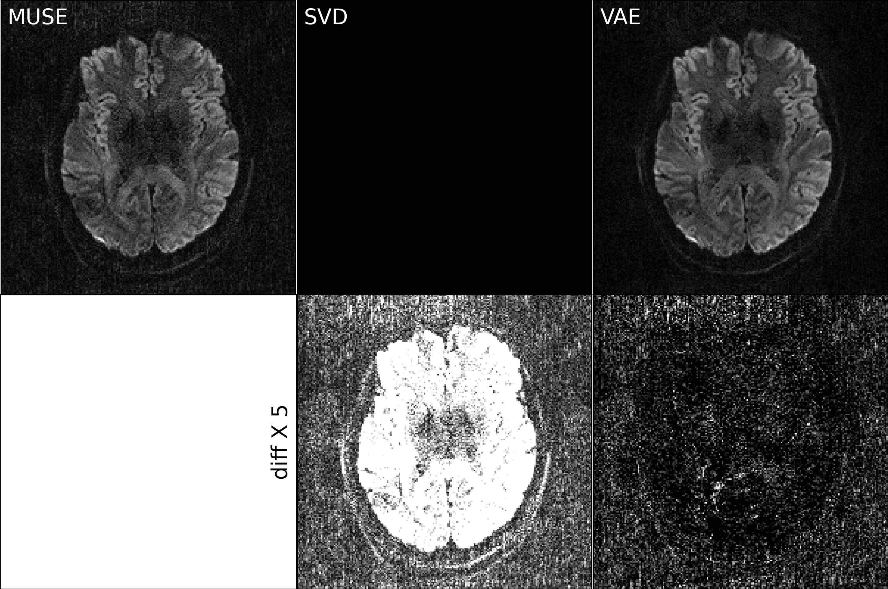
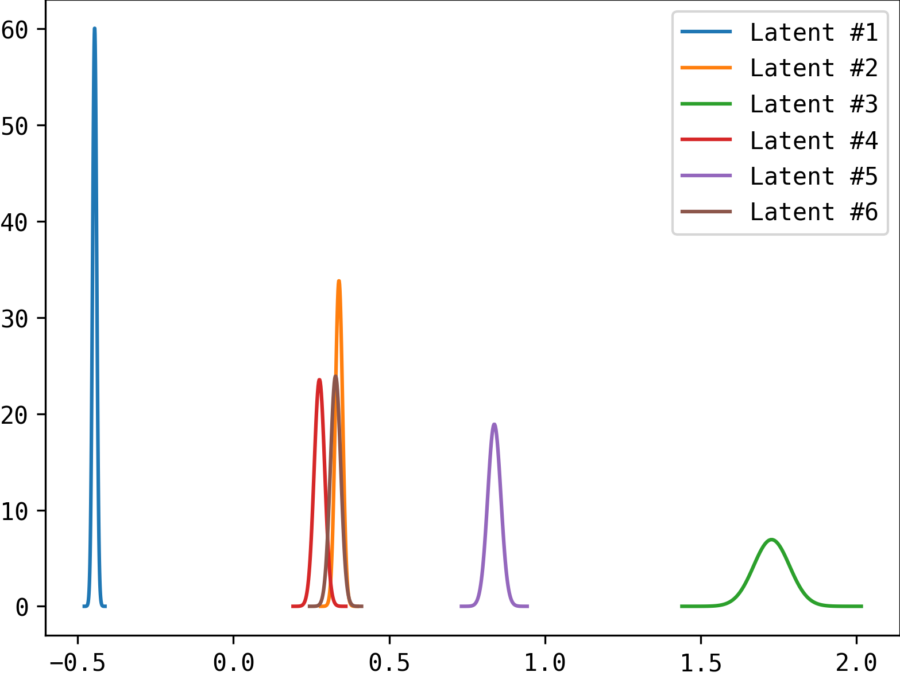

# This folder creates figures for variational autoencoder (VAE).

## 0. setup the directory of the `DeepDWI` folder in the terminal:

```bash
export DWIDIR=/path/to/DeepDWI
```

## 1. train a VAE model

```bash
cd ${DWIDIR}/examples
python vae_training.py
```

## 2. comapre VAE and SVD

```bash
cd ${DWIDIR}/figures/vae_vs_linsub
gedit config.yaml  # modify 'checkpoint' and 'N_latent' to those from Step 1
python run_mse.py
python plot_mse.py  # this outputs 'vae_vs_linsub_mse.png'
```

## 3. compare VAE and SVD on in vivo data

```bash
cd ${DWIDIR}/figures/vae_vs_linsub
python run_brain.py
python plot_brain.py --diff_idx 19  # this outputs 'vae_vs_linsub_brain_diff_19.png'
```

<p align="center">
  
</p>

## 4. plot the learned data distribution

```bash
cd ${DWIDIR}/figures/vae_vs_linsub
python plot_latent.py  # this outputs 'vae_latent.png'
```

<p align="center">
  
</p>
